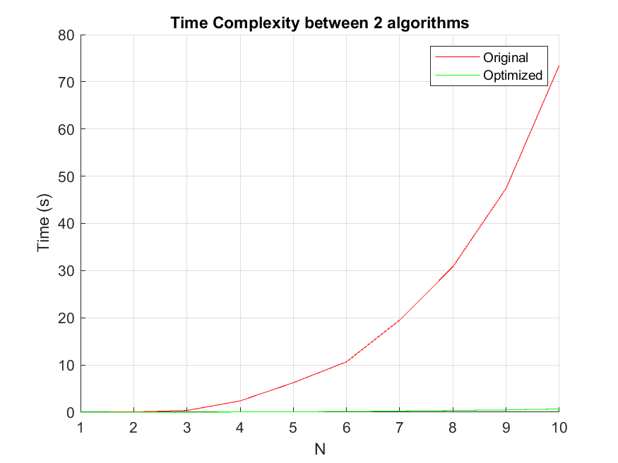

# Pore Size Distribution Analysis — MATLAB Implementation

This repository provides a MATLAB implementation of the **image-based pore size distribution (PSD)** method proposed by **Yang et al. (2009)**, together with an **optimized, high-performance version** suitable for analyzing large 3D porous structures obtained from CT or microscopy imaging.

The repository reproduces the mathematical and algorithmic core of the original paper, validates it using benchmark datasets, and introduces a drastically improved implementation that reduces computation time by over **two orders of magnitude** without altering the scientific output[cite: 5].

---

## 🧾 Reference Paper

> **Yang, Z., Peng, X.-F., Lee, D.-J., Chen, M.-Y. (2009)**  
> *An Image-Based Method for Obtaining Pore-Size Distribution of Porous Media*  
> Environmental Science & Technology, 43(9), 3248–3253.  
> [DOI: 10.1021/es900097e]

The method presents a purely image-based, non-destructive approach to compute the **pore size distribution (PSD)** of porous materials from 3D binary images.  
It reproduces the behavior of a **Mercury Intrusion Porosimeter (MIP)** algorithmically — measuring how pore volume accumulates as a function of equivalent pore diameter — without physically altering the sample[cite: 5].

---

## ⚙️ Method Overview

The algorithm performs the following key steps:

1. **Input:** A 3D **binary volume** C(x, y, z) representing the porous structure. According to the original paper by **Yang et al. (2009)**, after image binarization using Otsu’s method:
   > “White pixels (value **1**) represent **pore regions**, while black pixels (value **0**) correspond to **solid mass**.” 
   
   Therefore, the correct input convention is:

   | Value | Meaning | Color (in the paper) |
   |--------|----------|----------------------|
   | **1** | **Pore (void space)** | White |
   | **0** | **Solid (matrix)** | Black |

   ⚠️ *If your CT or microscopy data uses the opposite convention (e.g., 1 = solid), simply invert it before running the algorithm:*
   ```matlab
   C = ~C;   % Flip 0 ↔ 1 to match the Yang et al. (2009) convention
   ```
2. **Critical radius (C₀):** For each pore voxel, find the largest sphere fully contained within the pore space.  
3. **Radius propagation (C₁):** Expand regions from largest to smallest radii to map the volume contribution of each pore size.  
4. **Distribution curve (Re):** Compute the histogram of pore volumes as a function of equivalent radius.  
5. **Output:** A pore-size distribution curve and a color-coded 3D pore map[cite: 5].

---

## 🧠 Algorithmic Improvements and Performance Gains

### Overview

The **original implementation** (Yang et al., 2009) faithfully executed the method but relied on **six levels of nested loops**, testing each voxel’s local sphere explicitly[cite: 5].  
The **optimized version** replaces these manual geometric checks with vectorized distance transforms and dynamic spatial confinement. It introduces four core architectural optimizations to achieve equivalent precision at a fraction of the computational and memory cost[cite: 4]:

1. **Serial by Default:** Avoids worker initialization overhead and maximizes legacy compatibility.
2. **Bounding Box Confinement:** Calculates distance transforms strictly within localized sub-volumes.
3. **Ultra-Low Memory Parallelism:** Ensures parallel workers do not allocate full-size temporary volumes.
4. **Data Downcasting:** Aggressive use of `single` and `int16` types cuts memory usage by up to 75%[cite: 4].

---

### ⚖️ Architectural Decision: Serial by Default & Ultra-Low Memory Parallelism

While earlier iterations of this algorithm struggled with Out-Of-Memory (OOM) errors when deploying `parpool` across large 3D matrices, the current optimized version resolves this via **Ultra-Low Memory Parallelism**[cite: 4]. 

When parallel processing is explicitly enabled (`useParallel = true`), workers no longer allocate full-volume temporary matrices[cite: 4]. Instead, they extract a localized spatial **Bounding Box** around the target pores, calculate the `bwdist` strictly within that small crop, and return only the localized result coordinates[cite: 4]. These fragments are sequentially reduced into the main volume post-loop, entirely avoiding RAM saturation[cite: 4].

Despite this highly efficient parallel architecture, the function operates in **Serial Mode by default**[cite: 4]. This deliberate choice eliminates thread-initialization overhead for smaller volumes, guarantees absolute deterministic stability, and ensures 100% compatibility with legacy MATLAB environments where distance transform functions are not inherently thread-safe[cite: 4].

---

### 🔬 1. Critical Radius Computation (C₀)

| Aspect | Original | Optimized |
|---------|-----------|-----------|
| Method | Iteratively expands a sphere around every pore voxel via nested loops[cite: 5]. | Uses MATLAB’s built-in `bwdist` (Euclidean distance transform) on a padded array[cite: 4]. |
| Memory | Standard 64-bit arrays (`double`)[cite: 5]. | Downcasts to 4-byte `single` precision (halving RAM usage) and immediately clears heavy padded matrices[cite: 4]. |
| Result | `C0(i,j,k)` updated incrementally[cite: 5]. | `C0(C) = ceil(D_center(C) - tol) - 0.5;` — exact, vectorized solution[cite: 4]. |

---

### ⚙️ 2. Pore Region Propagation (C₁)

| Aspect | Original | Optimized |
|---------|-----------|-----------|
| Logic | Expands every voxel’s radius region via nested coordinate loops[cite: 5]. | Extracts a local **Bounding Box** sub-volume around centers of a given radius `s` and calculates `bwdist` strictly within this isolated sub-volume[cite: 4]. |
| Data type | Double (full precision)[cite: 5]. | 2-byte `uint16` matrix, with pre-processing operations strictly mapped using `int16` indexing[cite: 4]. |
| Safety | Implicit overwriting[cite: 5]. | Uses a localized logical mask `(subC1 == 0)` to guarantee smaller pores never overwrite larger assigned pores[cite: 4]. |

---

### ⚡ 3. Intelligent I/O and Memory Management

The process of loading and processing large volumetric datasets has been thoroughly optimized to prevent memory swapping and CPU bottlenecks[cite: 5]:

*   **Memory-Fused I/O:** The `load_volume` script abolishes the need to load the entire volume in 32-bit floating point. It reads and binarizes slices sequentially directly into a 1-bit `logical` mask array, cutting memory consumption massively[cite: 5].
*   **Early Memory Release:** Matrices that serve temporary functions (such as `Dpad` and `Cpad` during distance transforms) are explicitly cleared from memory immediately after their usage. This ensures that peak RAM usage remains flat until the end of the pipeline[cite: 4, 5].

---

## 📊 Performance Benchmark



The figure compares average computation time for the two implementations analyzing a **100³ voxel volume**[cite: 5]:

| Version                | Description                    | Avg. Time (s) | Speedup |
|------------------------|---------------------------------|---------------|----------|
| Original (Yang 2009)   | Nested-loop implementation      | 58.07         | —        |
| Optimized              | Vectorized + Bounding Box       | 0.48          | 120×     |

All benchmark data are available in [`results/ts.csv`](results/ts.csv)[cite: 5].

---

## 📁 Repository Structure

```text
pore-distribution-matlab/
│
├── data/
│   ├── CT_01/*.bmp 
│   ├── CT_02/*.tif
│   └── SinglePore/*.bmp
│
├── docs/
│   ├── an-image-based-method-for-obtaining-pore-size-distribution-of-porous-media.pdf
│   └── es900097e_si_001.pdf
│
├── src/
│   ├── poredistribution_yang_original.m
│   ├── poredistribution_yang_optimized.m
│   ├── load_volume.m
│   ├── remap_volume.m
│   ├── benchmark_time_complexity.m
│   └── main.m
│
├── results/
│   ├── ts.csv
│   ├── results_original_alg.png
│   └── time_complexity.png
│
├── LICENSE
└── README.md
```

---

## 🧩 Applications

*   Porous media and soil structure analysis
*   3D biofilm and biomaterial imaging
*   Filtration membrane fouling studies
*   Geological core and rock porosity analysis
*   Tissue engineering and scaffold characterization[cite: 5]

---

## 🧠 Scientific Significance

The Yang et al. method enables quantitative, non-destructive analysis of 2D or 3D pore structures from image data. Unlike traditional porosimetry, it:
*   Preserves sample integrity;
*   Works with **closed or disconnected pores**;
*   Provides **local geometric mapping** of pore size and connectivity;
*   Supports **direct comparison between digital and experimental results**[cite: 5].

---

## 📚 References

1. **Yang, Z., Peng, X.-F., Lee, D.-J., Chen, M.-Y. (2009)** — *An Image-Based Method for Obtaining Pore-Size Distribution of Porous Media.* Environmental Science & Technology, 43(9), 3248–3253.
2. **Yang, Z., Peng, X.-F., Lee, D.-J., Chen, M.-Y. (2008)** — *Supporting Information: Image-based method for obtaining pore-size distribution of porous biomasses.* Environmental Science & Technology, Supporting Information.
3. **MathWorks (2024)** — MATLAB Documentation[cite: 5].

---

## 🧾 License

This repository is released under the **MIT License**.  
When using this implementation in academic or industrial research, please cite the original publication by **Yang et al. (2009)** and acknowledge the optimized MATLAB adaptation[cite: 5].
